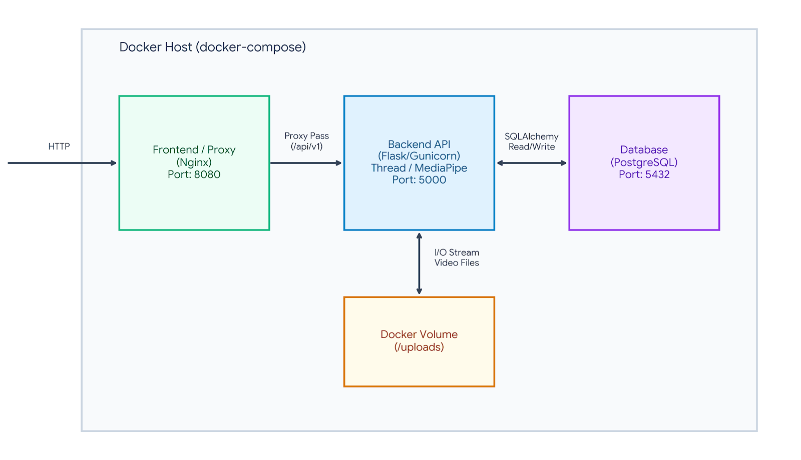

**Cortex : Video Face Detection Pipeline**

Cortex is a containerized, full-stack application designed to accept video uploads, process frames to detect facial regions of interest (ROI) without relying on OpenCV for rendering, and return both the visual feed and JSON coordinate data to a clean web interface.

**Architecture Diagram**




**🚀 Setup & Documentation (The 5-Minute Run)**

This system relies on exactly one dependency: Docker. No local Python environments or database installations are required.

1. **Clone the repository:**

```
git clone https://github.com/AbhinavG786/Cortex.git
cd Cortex 
```

2. **Start the environment:**

```
docker compose up --build
```

3. **Access the application:**

- **Frontend UI:** Open your browser and navigate to `http://localhost:8080`

- **API Base:** `http://localhost:8080/api/v1/videos`

- **Run Tests:** `docker compose exec backend pytest -v`


**🏗 Architecture & Separation of Concerns**

The application follows a strictly decoupled, 3-layer architecture orchestrated via Docker:

1. **Nginx Reverse Proxy & Static Server:** Serves the vanilla JS frontend and routes `/api/v1` requests securely to the backend container, entirely bypassing CORS issues.

2. **Flask Application Factory:** Follows the Controller-Service-Repository pattern. Routes are isolated in blueprints, business logic (AI processing) is isolated in services, and DB interactions are handled by SQLAlchemy models.

3. **PostgreSQL Database:** Handles persistent state and relationship mapping.


**⚖️ Pragmatism vs. Over-engineering**

- **Vanilla JS over React:** The UI is a single page requiring basic DOM manipulation and polling. Implementing a massive node_modules/bundler stack was rejected in favor of zero-build HTML/JS.

- **Background Threads over Celery/Redis:** Processing video is asynchronous. Rather than introducing complex message brokers (Kafka/RabbitMQ) for a single take-home task, a native Python background thread triggers the pipeline while instantly returning a `202 Accepted` to the client.

- **MediaPipe & ImageIO over OpenCV:** OpenCV is a massive dependency. By utilizing Google's MediaPipe (for CPU-optimized AI inference) alongside `imageio` and `Pillow`, we drastically reduced image size and explicitly satisfied the "No OpenCV drawing" requirement. *Note: We intentionally pinned `mediapipe==0.10.9` to prevent `pip` from downloading unnecessary LLM `torch` dependencies, slashing container build times.*


**🔌 API Design & Contracts**

The API strictly adheres to REST semantics and status codes:

- `POST /api/v1/videos` -> Uploads video. Returns `202 Accepted` (processing started) with a JSON payload containing the Video ID.

- `GET /api/v1/videos/{id}/roi` -> Returns `200 OK` with JSON coordinate mapping. If still processing, returns current status.

- `GET /api/v1/videos/{id}/stream` -> Returns the raw MP4 binary stream. Returns `400 Bad Request` if accessed before processing finishes.


**🗄 Database & Schema Design**

Implemented via PostgreSQL and SQLAlchemy. The schema handles a One-to-Many relationship using strict Foreign Keys and cascade deletes.

- `Video:` Tracks `id`, `filename`, and a `status` enum (`pending`, `processing`, `completed`, `failed`).

- `ROI:` Tracks `frame_number` alongside `x_min`, `y_min`, `width`, and `height`. We utilize `Float` types for coordinates to maintain sub-pixel accuracy directly from the AI model output.

- **Performance:** Database insertions for frames are performed using `db.session.bulk_save_objects()` to prevent thrashing the database with hundreds of individual commit transactions per video.


**🛡 Security Fundamentals**

- **Environment Abstraction:** Database credentials and internal ports are handled via a `.env` file injected at runtime, never hardcoded.

- **Nginx Gatekeeping:** A `client_max_body_size` directive restricts payload anomalies at the edge.

- **Directory Traversal Protection:** User uploads are explicitly sanitized using `secure_filename()` before being saved to disk, preventing malicious arbitrary file writes.

- **CORS Elimination:** The Nginx reverse-proxy approach makes the API and frontend share an origin (`localhost:8080`), satisfying browser security policies without explicitly opening the backend API to wildcards (`*`).


**🚨 Error Handling & Edge Cases**

- **Malformed Payloads:** Submitting empty forms, missing files, or non-video extensions (`.txt`, `.sh`) immediately trigger a `400 Bad Request` with a JSON error schema.

- **Orphaned State Prevention:** The Gunicorn startup sequence utilizes a command chain (`create_app() && gunicorn`) to prevent multi-worker race conditions on database initialization.

- **Fallback Configurations:** The test suite and application factory gracefully fallback to local in-memory SQLite if PostgreSQL environment variables drop out (e.g., inside CI/CD pipelines).


**🧪 Testing Scope**

We utilize `pytest` to validate core logic and API contracts using an isolated, ephemeral SQLite `:memory:` database to prevent test pollution.

- `test_upload_missing_file_returns_400`: Verifies edge-case payload handling.

- `test_upload_invalid_file_type_returns_400`: Verifies basic security hygiene.

- `test_get_roi_for_nonexistent_video_returns_404`: Validates URL parameters.

- `test_successful_video_upload_lifecycle`: Mocks the background worker and verifies the `202 Accepted` API contract structure.

(*Automated via GitHub Actions CI on push*)


**📌 Explicit Assumptions & Constraints**

1. **"Feed" Interpretation:** Standard HTTP does not natively support bidirectional, continuous 30FPS live streaming. For pragmatic simplicity, "feed" was interpreted as a discrete video file upload.

2. **Payload Limitation:** Nginx and Flask are strictly configured to accept files up to `50MB` to prevent Denial of Service (DoS) memory exhaustion.

3. **Single Subject Focus:** Per the prompt, the AI loop explicitly extracts index `[0]` from the detection results, ignoring background faces.


**🔭 Future Improvements**

- **WebSockets for Live Feeds:** To support a true webcam "live feed", the architecture could pivot to `Flask-SocketIO`, pushing Base64 frame strings over a persistent WebSocket connection instead of HTTP POST.

- **S3 Integration:** Local volume mounts (`/uploads`) do not scale horizontally. In production, `boto3` would push uploaded media directly to AWS S3.

- **Message Broker:** Background threads run inside the Gunicorn worker memory. A robust production setup would offload this to a dedicated Celery worker pool reading from Redis/RabbitMQ.


**🤖 AI Collaboration Attestation**

In accordance with the assignment guidelines, I am providing full transparency regarding the use of AI assistants during the development of this system.

Coming from a strong background in backend architecture with primary tech stacks as Node & Go , I utilized AI primarily as a syntax accelerator to rapidly translate my system design concepts into idiomatic Python and Flask within the required timeframe.

**Engineering Decisions I Own (Architecture & Logic):**

- **System Design:** The decision to utilize a decoupled 3-layer architecture and implement an Nginx reverse proxy to eliminate CORS and abstract environment variables.

- **Pragmatic Trade-offs:** The specific selection of `MediaPipe` and `imageio` over OpenCV to satisfy constraints while ensuring CPU-friendly AI inference, and the choice of native background threading over a heavy Celery/Redis queue.

- **Database Modeling**: The relational schema design in PostgreSQL, including foreign key constraints and the strategy to use in-memory arrays for bulk database insertions to prevent I/O bottlenecking.

- **API Contracts:** The design of the RESTful endpoints, state management, and strict HTTP status code semantics (e.g., returning `202 Accepted` for async processing).

**Where AI Was Utilized (Syntax & Scaffolding):**

- Translating my architectural logic into standard Python and Flask Application Factory boilerplate.

- Generating the initial scaffolding for the `Dockerfile`, `docker-compose.yml`, and `nginx.conf` files.

- Setting up the `pytest` fixtures, including the isolated `:memory:` database configuration in `conftest.py`.

- Generating the base CSS variables and layout structure for the vanilla HTML/JS frontend.

This collaboration model allowed me to focus my time entirely on the core engineering challenges - system design, separation of concerns, and pragmatism - while delivering a clean, containerized solution.